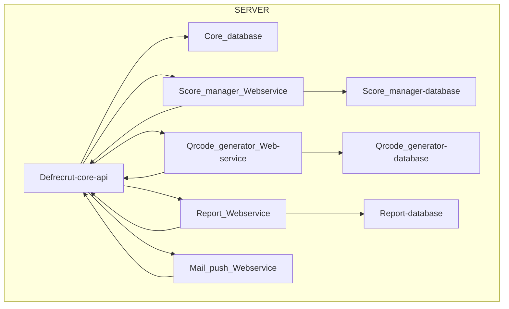

```mermaid
graph TD;
    subgraph SERVER
        Defrecrut-core-api --> Core_database;
        Defrecrut-core-api --> Score_manager_Webservice;
        Defrecrut-core-api --> Qrcode_generator_Web-service;
        Defrecrut-core-api --> Report_Webservice;
        Defrecrut-core-api --> Mail_push_Webservice;
        Mail_push_Webservice --> Defrecrut-core-api;

        Score_manager_Webservice --> Score_manager-database;
        Score_manager_Webservice --> Defrecrut-core-api;

        Qrcode_generator_Web-service --> Qrcode_generator-database;
        Qrcode_generator_Web-service --> Defrecrut-core-api;

        Report_Webservice --> Report-database;
        Report_Webservice --> Defrecrut-core-api;
    end
```
