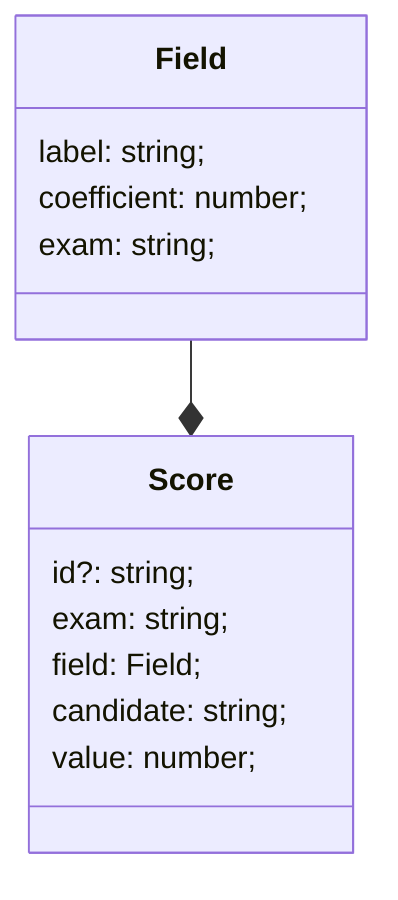

```mermaid
classDiagram
class Field {
    label: string;
    coefficient: number;
    exam: string;
}

class Score {
    id?: string;
    exam: string;
    field: Field;
    candidate: string;
    value: number;
}

Field --* Score
```
